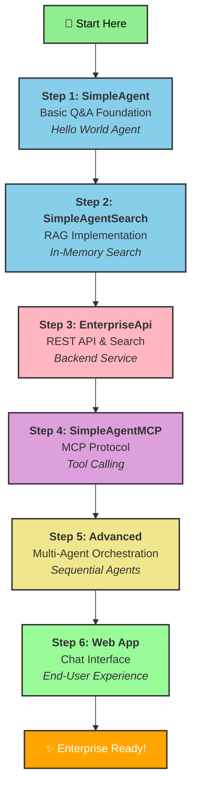

# 🚀 Demo Flow Guide - Azure AI Agents

> **Visual learning path from simple to advanced agent implementations**

---

## 📊 Interactive Flow Diagram



---

## 🎯 Detailed Step-by-Step Guide

### 📌 Step 1: SimpleAgent - Basic Q&A Foundation

**What:** Foundational AI agent with Microsoft Agent Framework  
**Purpose:** Learn how to initialize an agent and handle basic interactions  
**Difficulty:** ⭐ Beginner

#### Key Concepts:
- `AIProjectClient` initialization with Azure credentials
- `DefaultAzureCredential` for authentication
- Direct agent creation and question-answering
- Rich console UI with Spectre.Console

#### Code Structure:
```csharp
// Initialize AI Project Client
AIAgent agent = new AIProjectClient(new Uri(endpoint), new DefaultAzureCredential())
    .AsAIAgent(
        model: deploymentName,
        instructions: "You are a friendly assistant...",
        name: "SimpleAgentToStartWith");

// Run agent
var answer = await agent.RunAsync(question);
```

#### 📂 Location:
📍 `src/AgentScratchEnterprise/ASE.SimpleAgent/`

#### 🔧 Environment Variables Required:
```bash
# Azure AI Foundry Configuration
ENDPOINT=https://your-project.services.ai.azure.com
DEPLOYMENTNAME=gpt-4o
```

#### 🏃 Run It:
```bash
cd src/AgentScratchEnterprise/ASE.SimpleAgent
dotnet run
```

#### 💡 What You'll Learn:
- ✅ Agent Framework basics
- ✅ Azure authentication patterns
- ✅ Synchronous agent invocation
- ✅ Console interaction patterns

#### 📖 Related:
- [Microsoft Agents Framework Docs](https://github.com/microsoft/agents-ai)
- [Azure AI Projects SDK](https://learn.microsoft.com/azure/ai-foundry/reference/sdk-overview)

---

### 📌 Step 2: SimpleAgentSearch - RAG Implementation

**What:** Retrieval-Augmented Generation (RAG) with in-memory search  
**Purpose:** Enhance agents with knowledge base context  
**Difficulty:** ⭐⭐ Intermediate

#### Key Concepts:
- Document search integration
- In-memory text search provider
- RAG pattern implementation
- OpenTelemetry monitoring integration
- Application Insights integration

#### Architecture:
```
Question 
   ↓
Search Documents (In-Memory)
   ↓
Augment Context
   ↓
Agent Processing
   ↓
Answer
```

#### Code Structure:
```csharp
TextSearchProviderOptions textSearchOptions = new()
{
    SearchTime = TextSearchProviderOptions.TextSearchBehavior.BeforeAIInvoke,
};

// Agent uses search results as context
AIAgent agent = new AIProjectClient(...)
    .AsAIAgent(...);
```

#### 📂 Location:
📍 `src/AgentScratchEnterprise/ASE.SimpleAgentSearch/`

#### 🔧 Environment Variables Required:
```bash
# Base Configuration
ENDPOINT=https://your-project.services.ai.azure.com
DEPLOYMENTNAME=gpt-4o

# Monitoring
APPLICATION_INSIGHTS_CONNECTION_STRING=InstrumentationKey=...;IngestionEndpoint=...
```

#### 🏃 Run It:
```bash
cd src/AgentScratchEnterprise/ASE.SimpleAgentSearch
dotnet run
```

#### 💡 What You'll Learn:
- ✅ RAG pattern implementation
- ✅ Document search integration
- ✅ OpenTelemetry setup
- ✅ Application Insights monitoring
- ✅ Context augmentation

#### 📖 Related:
- [RAG Pattern Overview](https://learn.microsoft.com/azure/ai-services/retrieval-augmented-generation-rag)
- [Search Provider Documentation](./projects.md#document-search)

---

### 📌 Step 3: EnterpriseApi - REST API & Search Backend

**What:** ASP.NET Minimal API with search capabilities  
**Purpose:** Build scalable backend service with REST endpoints  
**Difficulty:** ⭐⭐ Intermediate

#### Key Concepts:
- Minimal API setup
- Environment-based search provider switching
- In-memory search vs Azure AI Search
- MCP Server integration
- RESTful endpoints

#### Features:
| Endpoint | Purpose | Method |
|----------|---------|--------|
| `/health` | Health check | GET |
| `/basic/get-all` | Retrieve all documents | GET |
| `/basic/search?query=` | Basic search | GET |
| `/advanced/search?query=` | Search with agents | GET |
| `/mcp` | MCP Protocol endpoint | WebSocket |

#### 📂 Location:
📍 `src/AgentScratchEnterprise/ASE.EnterpriseApi/`

#### 🔧 Environment Variables Required:
```bash
# Azure AI Foundry
ENDPOINT=https://your-project.services.ai.azure.com
DEPLOYMENTNAME=gpt-4o

# Search Configuration
Search__Environment=LOCAL  # or AZURE
Search__ServiceName=your-search-service
Search__ApiKey=your-search-key

# CORS Configuration
Cors__AllowedOrigins=http://localhost:3000
```

#### 🏃 Run It:
```bash
cd src/AgentScratchEnterprise/ASE.EnterpriseApi
dotnet run
```

#### 📋 Test with HTTP Client:
View `ApiTests.http` for ready-to-use REST calls:
```http
### Health Check
GET http://localhost:5000/health

### Search with Agents
GET http://localhost:5000/advanced/search?query=return
```

#### 💡 What You'll Learn:
- ✅ Minimal API patterns
- ✅ Dependency injection
- ✅ Search provider abstraction
- ✅ REST API design
- ✅ MCP server setup
- ✅ CORS configuration

#### 📖 Related:
- [ASP.NET Minimal APIs](https://learn.microsoft.com/aspnet/core/fundamentals/minimal-apis)
- [Model Context Protocol](https://modelcontextprotocol.io/)

---

### 📌 Step 4: SimpleAgentMCP - MCP Protocol Integration

**What:** Agent invoking business API via Model Context Protocol  
**Purpose:** Demonstrate tool calling and external API integration  
**Difficulty:** ⭐⭐⭐ Advanced

#### Key Concepts:
- Model Context Protocol (MCP) client setup
- Tool discovery from MCP server
- Tool-calling agent pattern
- Sequential API invocations
- Error handling with external services

#### Architecture:
```
User Question
   ↓
SimpleAgentMCP (Client)
   ↓
Connect to EnterpriseApi (MCP Server)
   ↓
Discover Available Tools
   ↓
Agent Processes with Tools
   ↓
Tool Execution (Search)
   ↓
Agent Generates Answer
```

#### Code Structure:
```csharp
// Create MCP Transport
var transport = new HttpClientTransport(
    new HttpClientTransportOptions
    {
        Name = "My Business Api Search",
        Endpoint = new Uri(mcpEndpoint)
    });

// Initialize MCP Client
var mcpClient = await McpClient.CreateAsync(transport);
var tools = await mcpClient.ListToolsAsync();

// Create Agent with Tools
AIAgent agent = new AIProjectClient(...)
    .AsAIAgent(..., tools: [..tools]);
```

#### 📂 Location:
📍 `src/AgentScratchEnterprise/ASE.SimpleAgentMcp/`

#### 🔧 Environment Variables Required:
```bash
# Azure AI Foundry
ENDPOINT=https://your-project.services.ai.azure.com
DEPLOYMENTNAME=gpt-4o

# MCP Server Configuration
McpEndpoint=http://localhost:5000/mcp
```

#### 🏃 Run It:
**Terminal 1 - Start the API:**
```bash
cd src/AgentScratchEnterprise/ASE.EnterpriseApi
dotnet run
```

**Terminal 2 - Run the MCP Agent:**
```bash
cd src/AgentScratchEnterprise/ASE.SimpleAgentMcp
dotnet run
```

#### Sample Question:
```
"What is the return policy for Contoso?"
```

#### 💡 What You'll Learn:
- ✅ MCP client initialization
- ✅ Tool discovery mechanism
- ✅ Tool calling patterns
- ✅ Multi-process communication
- ✅ Error recovery strategies

#### 📖 Related:
- [Model Context Protocol Specification](https://spec.modelcontextprotocol.io/)
- [MCP SDK for .NET](https://github.com/modelcontextprotocol/sdk-dotnet)

---

### 📌 Step 5: Advanced - Multi-Agent Orchestration

**What:** Sequential agent orchestration with translation  
**Purpose:** Demonstrate complex agent workflows  
**Difficulty:** ⭐⭐⭐ Advanced

#### Key Concepts:
- Agent chaining
- Sequential execution patterns
- Output translation/transformation
- State management between agents
- Error propagation

#### Flow Pattern:
```
Query
  ↓
Agent 1: Search Query
  ↓ (Results)
Agent 2: Translate Results
  ↓ (Final Output)
Response
```

#### Use Cases:
- 🔍 Search → Summarization pipeline
- 📊 Data retrieval → Analytics pipeline
- 🌍 Multi-language workflows
- 🎯 Progressive refinement

#### 💡 Key Features:
- Sequential task execution
- State passing between agents
- Output transformation
- Conditional routing based on results

#### 📖 Related:
- [Agent Orchestration Patterns](./architecture.md)

---

### 📌 Step 6: Web App - Chat Interface

**What:** Vue.js frontend for interactive chat  
**Purpose:** End-user experience and integration  
**Difficulty:** ⭐⭐ Intermediate

#### Key Components:
- Vue 3 with TypeScript
- Real-time WebSocket communication
- Chat UI with message history
- MCP integration display
- Response streaming

#### 📂 Location:
📍 `src/chat-web-app/`

#### 🏃 Run It:
```bash
cd src/chat-web-app
npm install
npm run dev
```

#### Environment Configuration:
Configure API endpoint in `.env`:
```bash
VITE_API_URL=http://localhost:5000
```

#### 💡 Features:
- ✅ Real-time messaging
- ✅ Agent response display
- ✅ Tool usage visualization
- ✅ Error handling
- ✅ Session management

---

## 🧪 Testing Your Setup

### Quick Verification Checklist:

```bash
# 1. Check .NET installation
dotnet --version

# 2. Verify Azure credentials
az account show

# 3. Test Step 1: SimpleAgent
cd src/AgentScratchEnterprise/ASE.SimpleAgent && dotnet run

# 4. Test Step 3: Start API
cd src/AgentScratchEnterprise/ASE.EnterpriseApi && dotnet run

# 5. Test Step 4: Run MCP Agent (in another terminal)
cd src/AgentScratchEnterprise/ASE.SimpleAgentMcp && dotnet run
```

### Troubleshooting:
- 🔴 **Authentication error**: Run `az login`
- 🔴 **Connection refused**: Check endpoint URLs and ports
- 🔴 **Missing dependencies**: Run `dotnet restore`

---

## 📚 Supporting Projects

### ASE.Libraries
**Purpose:** Shared components and utilities  
**Contains:**
- `Search/` - Search provider abstractions
- `General/` - Common utilities
- `Models/` - Domain models
- `Data/` - Sample data

### Tests (ASE.Libraries.Tests)
**Purpose:** Unit and integration tests  
**Contains:**
- Search provider tests
- Agent integration tests
- End-to-end scenarios

**Run Tests:**
```bash
cd tests/ASE.Libraries.Tests
dotnet test
```

---

## 🔐 Security & Configuration

### Environment Variables Summary:

| Variable | Purpose | Example | Required |
|----------|---------|---------|----------|
| `ENDPOINT` | Azure AI Foundry endpoint | `https://xxx.services.ai.azure.com` | ✅ All |
| `DEPLOYMENTNAME` | Model deployment name | `gpt-4o` | ✅ All |
| `APPLICATION_INSIGHTS_CONNECTION_STRING` | Monitoring connection | `InstrumentationKey=...` | SimpleAgentSearch |
| `McpEndpoint` | MCP server URL | `http://localhost:5000/mcp` | SimpleAgentMcp |
| `Search__Environment` | Search provider type | `LOCAL` or `AZURE` | EnterpriseApi |
| `Search__ServiceName` | Azure Search service | `my-search-service` | EnterpriseApi (AZURE) |
| `Search__ApiKey` | Azure Search key | `xxxxx` | EnterpriseApi (AZURE) |
| `Cors__AllowedOrigins` | CORS allowed origins | `http://localhost:3000` | EnterpriseApi |

### Configuration Files:

#### EnterpriseApi - appsettings.json
```json
{
  "Search": {
    "Environment": "LOCAL",
    "ServiceName": "",
    "ApiKey": ""
  },
  "Cors": {
    "AllowedOrigins": ["http://localhost:3000"]
  }
}
```

---

## 🎓 Learning Path

### Recommended Order:
1. ✅ **Day 1:** Steps 1 & 2 (Understand agents and RAG)
2. ✅ **Day 2:** Step 3 (Build backend services)
3. ✅ **Day 3:** Step 4 (Master MCP integration)
4. ✅ **Day 4:** Step 5 (Complex workflows)
5. ✅ **Day 5:** Step 6 (Full-stack integration)

### Time Estimates:
- Step 1: 15-30 minutes
- Step 2: 30-45 minutes
- Step 3: 45-60 minutes
- Step 4: 45-60 minutes
- Step 5: 60-90 minutes
- Step 6: 30-45 minutes

---

## 🔗 Quick Links

### Documentation:
- 📖 [Getting Started](./getting-started.md)
- 🏗️ [Architecture](./architecture.md)
- ⚙️ [Configuration](./configuration.md)
- 🧪 [Testing Guide](./testing.md)
- 📊 [Architecture Diagrams](./diagrams.md)

### Code:
- 🤖 [Microsoft Agents Framework](https://github.com/microsoft/agents-ai)
- 🔧 [Model Context Protocol](https://modelcontextprotocol.io/)
- ☁️ [Azure AI Foundry](https://azure.microsoft.com/products/ai-foundry)

### Videos & Tutorials:
- 📺 [Agent Framework Introduction](https://learn.microsoft.com/azure/ai-foundry)
- 📺 [MCP Protocol Specification](https://spec.modelcontextprotocol.io/)

---

## ❓ FAQ

**Q: Do I need all steps?**  
A: No! Start with Step 1 to learn basics. Step 4 requires Step 3 to run.

**Q: Can I run multiple steps simultaneously?**  
A: Yes! They use different ports. Just set different environment configurations.

**Q: How do I switch between in-memory and Azure Search?**  
A: Set `Search__Environment` in EnterpriseApi configuration.

**Q: Where's the sample data?**  
A: Located in `ASE.Libraries/Data/` - modify as needed for your use case.

---

## 📞 Support & Questions

- 🐛 [Report Issues](https://github.com/bovrhovn/azure-demos-agents-from-scratch-to-enterprise/issues)
- 💬 [Discussions](https://github.com/bovrhovn/azure-demos-agents-from-scratch-to-enterprise/discussions)
- 📧 [Contact](./README.md)

---

**Last Updated:** 2024  
**Status:** ✅ Stable
