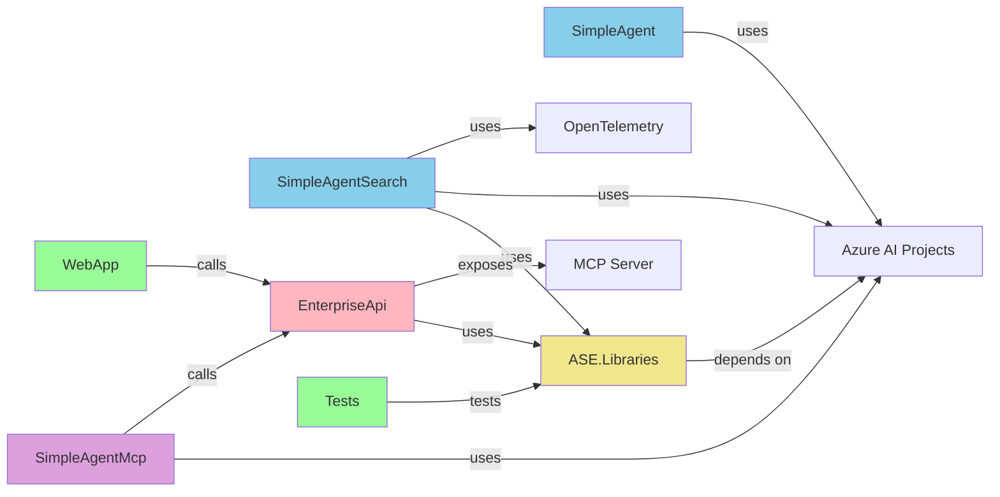

# 🔗 Project Reference Map

> Quick navigation guide for all projects, their relationships, and dependencies

---

## 📊 Solution Structure Reference

```
AgentScratchEnterprise/
│
├── 🤖 ASE.SimpleAgent
│   ├── Purpose: Hello World agent with Q&A capability
│   ├── Dependencies: Azure.AI.Projects, Microsoft.Agents.AI
│   ├── Output: Console application
│   └── Key File: Program.cs
│
├── 🔍 ASE.SimpleAgentSearch
│   ├── Purpose: Agent with RAG and search integration
│   ├── Dependencies: ASE.Libraries, OpenTelemetry, Application Insights
│   ├── Output: Console application with monitoring
│   └── Key Files: Program.cs, [search logic from ASE.Libraries]
│
├── 📡 ASE.EnterpriseApi
│   ├── Purpose: REST API with search & MCP server
│   ├── Type: ASP.NET Minimal API
│   ├── Dependencies: ASE.Libraries, ModelContextProtocol
│   ├── Endpoints:
│   │   ├── GET /health
│   │   ├── GET /basic/get-all
│   │   ├── GET /basic/search?query=
│   │   ├── GET /advanced/search?query=
│   │   └── WebSocket /mcp
│   └── Key Files: Program.cs, Routes/*, Tools/*
│
├── 🔧 ASE.SimpleAgentMcp
│   ├── Purpose: Agent that calls business API via MCP
│   ├── Dependencies: ASE.EnterpriseApi (as external service)
│   ├── Output: Console application with tool calling
│   └── Key File: Program.cs
│
├── 📦 ASE.Libraries (Shared)
│   ├── Purpose: Reusable components and abstractions
│   ├── Components:
│   │   ├── Search/
│   │   │   ├── ISearchService (interface)
│   │   │   ├── DocumentSearchAdapter (in-memory impl)
│   │   │   └── AzureSearchDocumentSearchAdapter (Azure impl)
│   │   ├── General/ (utilities)
│   │   ├── Models/ (domain models)
│   │   └── Data/ (sample data)
│   └── References: Shared by SimpleAgentSearch, EnterpriseApi
│
├── 🧪 ASE.Libraries.Tests
│   ├── Purpose: Unit and integration tests
│   ├── References: ASE.Libraries
│   ├── Test Suites:
│   │   ├── DocumentSearchAdapterTests (8 tests)
│   │   ├── BankDataGeneratorTests (18 tests)
│   │   ├── SearchResultTests (4 tests)
│   │   ├── BankModelsTests (6 tests)
│   │   ├── AzureSearchDocumentSearchAdapterTests (4 tests)
│   │   ├── RouteNamesTests (7 tests)
│   │   └── ISearchServiceTests (4 tests)
│   └── Coverage: 51 tests, 100% pass rate
│
└── 💬 chat-web-app (Vue.js Frontend)
    ├── Purpose: Chat UI for end-user interaction
    ├── Framework: Vue 3 + TypeScript
    ├── Backend: Calls ASE.EnterpriseApi
    └── Features: Real-time messaging, tool visualization
```

---

## 🔄 Data Flow & Dependencies

### Simple Path: Step 1 Only
```
User Input
   ↓
ASE.SimpleAgent
   ↓ (uses)
Azure.AI.Projects SDK
   ↓ (calls)
Azure OpenAI
   ↓
Response
```

**Environment Variables:**
- `ENDPOINT`
- `DEPLOYMENTNAME`

---

### Enhanced Path: Step 2
```
User Input
   ↓
ASE.SimpleAgentSearch
   ├─→ ASE.Libraries.Search (search)
   │    └─→ DocumentSearchAdapter (in-memory)
   │         └─→ Sample Data
   └─→ Azure.AI.Projects SDK
        └─→ Azure OpenAI (with context)
   ↓
Response with citations
```

**Environment Variables:**
- `ENDPOINT`
- `DEPLOYMENTNAME`
- `APPLICATION_INSIGHTS_CONNECTION_STRING`

---

### Backend Service: Step 3
```
REST Clients / MCP Clients
   ↓
ASE.EnterpriseApi (REST + MCP Server)
   ├─→ Routes:
   │   ├─ /basic/* (search operations)
   │   ├─ /advanced/* (agent operations)
   │   └─ /mcp (tool server)
   └─→ ASE.Libraries.Search
        ├─→ DocumentSearchAdapter (LOCAL)
        └─→ AzureSearchDocumentSearchAdapter (AZURE)
   ↓
Response (JSON or tool results)
```

**Environment Variables:**
- `ENDPOINT`
- `DEPLOYMENTNAME`
- `Search__Environment` (LOCAL or AZURE)
- `Search__ServiceName` (if AZURE)
- `Search__ApiKey` (if AZURE)
- `Cors__AllowedOrigins`

---

### Tool Calling: Step 4
```
User Input
   ↓
ASE.SimpleAgentMcp
   ├─→ Connect to EnterpriseApi (MCP Client)
   │    └─→ List Tools
   └─→ Azure.AI.Projects SDK (with tools)
        ├─→ Tool Execution: Call EnterpriseApi
        │    └─→ EnterpriseApi.Search
        └─→ Generate Response
   ↓
Response using tool results
```

**Environment Variables:**
- `ENDPOINT`
- `DEPLOYMENTNAME`
- `McpEndpoint`

---

## 🎯 Project Quick Reference

| Project | Type | Purpose | Language | Main Dependencies | Startup |
|---------|------|---------|----------|-------------------|---------|
| SimpleAgent | Console | Basic Q&A | C# | Azure.AI.Projects | `dotnet run` |
| SimpleAgentSearch | Console | RAG with search | C# | ASE.Libraries, OT | `dotnet run` |
| EnterpriseApi | Web API | Backend service | C# | ASE.Libraries, MCP | `dotnet run` |
| SimpleAgentMcp | Console | Tool calling | C# | EnterpriseApi (external) | `dotnet run` |
| ASE.Libraries | Library | Shared code | C# | Azure.Search | (referenced) |
| Tests | Test Suite | Unit tests | C# | xUnit, ASE.Libraries | `dotnet test` |
| chat-web-app | Frontend | Chat UI | TypeScript | Vue 3, Vite | `npm run dev` |

---

## 🔗 Cross-Project References

### Direct Project References:
```
SimpleAgent           ← (none)
SimpleAgentSearch     ← ASE.Libraries
EnterpriseApi         ← ASE.Libraries
SimpleAgentMcp        ← (none, calls EnterpriseApi HTTP)
Tests                 ← ASE.Libraries
chat-web-app          ← (none, calls EnterpriseApi HTTP)
```

### External Service Dependencies:
```
All Projects → Azure AI Foundry (via Azure.AI.Projects)
SimpleAgentSearch → Application Insights (monitoring)
EnterpriseApi → (Optional) Azure AI Search (when Search__Environment=AZURE)
SimpleAgentMcp → EnterpriseApi (via HTTP + MCP)
chat-web-app → EnterpriseApi (via HTTP)
```

---

## 🏃 Execution Modes

### Single Project Execution:
```bash
# Terminal
cd src/AgentScratchEnterprise/ASE.SimpleAgent
dotnet run
```
- ✅ Works standalone
- ✅ Requires only Azure credentials
- ✅ No additional setup

### Two-Project Setup (Step 3 + Step 4):
```bash
# Terminal 1
cd src/AgentScratchEnterprise/ASE.EnterpriseApi
dotnet run  # Starts on port 5000

# Terminal 2 (wait for Terminal 1 to start)
cd src/AgentScratchEnterprise/ASE.SimpleAgentMcp
dotnet run  # Connects to localhost:5000/mcp
```
- ✅ Demonstrates MCP protocol
- ✅ Shows tool calling pattern
- ✅ Requires both services running

### Full Stack Setup (All 6 Steps):
```bash
# Terminal 1: Backend API
cd src/AgentScratchEnterprise/ASE.EnterpriseApi
dotnet run

# Terminal 2: Web Frontend
cd src/chat-web-app
npm run dev

# Terminal 3: Optional - MCP client
cd src/AgentScratchEnterprise/ASE.SimpleAgentMcp
dotnet run

# Browser: Navigate to http://localhost:3000
```
- ✅ Complete enterprise setup
- ✅ Web UI + backend API + MCP support
- ✅ Full learning experience

---

## 🔧 Configuration Layers

### Layer 1: Environment Variables (Highest Priority)
```bash
ENDPOINT=...
DEPLOYMENTNAME=...
McpEndpoint=...
Search__Environment=LOCAL
```

### Layer 2: appsettings.json
```json
{
  "Search": { "Environment": "LOCAL" },
  "Cors": { "AllowedOrigins": [...] }
}
```

### Layer 3: appsettings.{Environment}.json
Environment-specific overrides for Development, Production, etc.

### Layer 4: Defaults (Lowest Priority)
- In-memory search enabled
- Localhost CORS allowed

---

## 📊 Dependency Graph



---

## 🎓 Learning Path by Complexity

### Level 1: Foundations
- ✅ SimpleAgent - Understand basic agent creation
- ✅ ASE.Libraries - See reusable patterns

### Level 2: Integration
- ✅ SimpleAgentSearch - Learn RAG pattern
- ✅ EnterpriseApi - Build REST services

### Level 3: Advanced
- ✅ SimpleAgentMcp - Master tool calling
- ✅ Advanced scenarios - Multi-agent orchestration
- ✅ chat-web-app - End-to-end integration

---

## 🚀 Quick Start Commands

### Copy-Paste Ready:

```bash
# Step 1: Clone and setup
git clone https://github.com/bovrhovn/azure-demos-agents-from-scratch-to-enterprise.git
cd azure-demos-agents-from-scratch-to-enterprise

# Step 2: Set variables (PowerShell)
$env:ENDPOINT = "https://your-project.services.ai.azure.com"
$env:DEPLOYMENTNAME = "gpt-4o"

# Step 3: Run Simple Agent
cd src/AgentScratchEnterprise/ASE.SimpleAgent
dotnet run

# Step 4: Run tests
cd ../../..
cd tests/ASE.Libraries.Tests
dotnet test

# Step 5: Run Enterprise API
cd ../../src/AgentScratchEnterprise/ASE.EnterpriseApi
dotnet run

# Step 6: In another terminal, run MCP client
cd ../ASE.SimpleAgentMcp
$env:McpEndpoint = "http://localhost:5000/mcp"
dotnet run
```

---

## 📞 Support Matrix

| Issue | Solution | Documentation |
|-------|----------|---------------|
| Import/Build errors | `dotnet restore` | [Getting Started](./getting-started.md) |
| Azure auth fails | `az login` | [Configuration](./configuration.md) |
| Port conflicts | Change launch settings | [Troubleshooting](./troubleshooting.md) |
| Search not working | Set `Search__Environment` | [Configuration](./configuration.md) |
| MCP connection refused | Check `McpEndpoint` variable | [Demo Flow](./demo-flow.md#-step-4-simpleagentmcp) |
| Tests fail | Run `dotnet restore && dotnet build` | [Testing](./testing.md) |

---

**Last Updated:** 2024  
**Status:** ✅ Complete Reference
